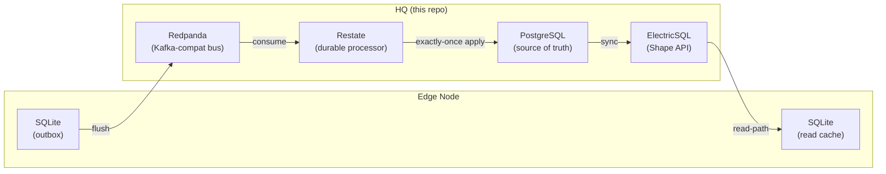

# OpenDDIL Stack

Central HQ infrastructure for the OpenDDIL framework — a CQRS, Event-Driven architecture designed for **DDIL** (Denied, Degraded, Intermittent, Limited) environments.

## Architecture



## Quick Start

```bash
# Start all services
docker compose up -d

# Watch Atlas apply the schema on first boot
docker compose logs -f atlas-init

# Apply ElectricSQL publication (one-time, after Atlas completes)
docker compose exec postgres psql -U openddil -d openddil -f /electric/electrify.sql
# Or from host:
# psql -h localhost -U openddil -d openddil -f electric/electrify.sql

# Tear down (including volumes)
docker compose down -v
```

## Service Endpoints

| Service | URL | Purpose |
|---|---|---|
| PostgreSQL | `localhost:5432` | Central database |
| ElectricSQL Shape API | `http://localhost:3000` | Read-path sync for Edge |
| Redpanda (Kafka API) | `localhost:9092` | Event ingestion |
| Redpanda Console | `http://localhost:8180` | Redpanda web UI |
| Restate Ingress | `http://localhost:8080` | Durable invocations |
| Restate Admin | `http://localhost:9070` | Register deployments |

## Schema Management (Atlas)

The database schema is managed **declaratively** using [Atlas](https://atlasgo.io). The desired state is defined in [`schema/schema.hcl`](schema/schema.hcl). On `docker compose up`, the `atlas-init` service automatically diffs the desired state against the live database and applies any necessary migrations.

To re-apply the schema after changes:

```bash
docker compose run --rm atlas-init
```

### Expand/Contract Migrations

For DDIL-safe schema evolution:

1. **Expand** — Add new columns/tables to `schema.hcl`. Old consumers still work.
2. **Deploy** — Update HQ processors and Edge SDKs to use the new schema.
3. **Contract** — Remove old columns/tables from `schema.hcl` once all nodes have migrated.

## ElectricSQL (Read Path)

Edge clients subscribe to Postgres table changes via the [Shape API](https://electric-sql.com/docs/guides/shapes):

```bash
# Full table sync
curl "http://localhost:3000/v1/shape?table=inventory_items&offset=-1"

# Filtered sync (partial replication)
curl "http://localhost:3000/v1/shape?table=inventory_items&where=available_count>0"
```

The `offset` parameter enables **resumable sync** — critical for DDIL environments where connections drop frequently.

## AI Documentation

Each repo in the OpenDDIL polyrepo includes these files for AI assistant context:

| File | Purpose |
|---|---|
| [`llms.txt`](llms.txt) | Structured project summary for LLM discovery — architecture, tech stack, key files, schema rules |
| [`.cursorrules`](.cursorrules) | Coding style and tech stack constraints — enforces Atlas-only schema, naming conventions, Docker patterns |
| [`AGENTS.md`](AGENTS.md) | AI agent safety guidelines — allowed/forbidden operations, schema change workflow, Expand/Contract rules |

## Repository Structure

```
openddil-stack/          ← You are here
openddil-contracts/      ← Protobuf event schemas
openddil-edge-dotnet/    ← .NET Edge SDK (Outbox + Relay)
openddil-edge-python/    ← Python Edge SDK (Outbox + Relay)
openddil-hq/             ← Python HQ SDK (Restate exactly-once processor)
openddil-regional-stack/ ← Regional Hub infrastructure (Redpanda Connect bridge)
openddil-sensor-ingest/  ← Sensor Ingestion Gateway & Legacy Bridge (Phase 7.1)
```
